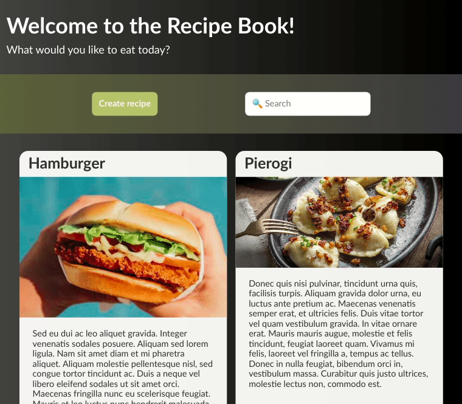

# Recipe Book

Simple web application for creating and browsing recipes.

## Technology stack

-   HTML
-   CSS
-   JavaScript

Data is stored via **localStorage**.

All of the code is processed with [**@babel/preset-env**](https://babeljs.io/docs/en/babel-preset-env) preset that allows to use latest JavaScript without worrying about target environment(s).

This project also uses import and export statements that come with [**Webpack**](https://webpack.js.org/) module bundler.

## Development with webpack-dev-server

```console
npm run dev-server
```

CSS refactor has not yet been done.

## Preview

Live version: [**bm-recipe-book.surge.sh**](https://bm-recipe-book.surge.sh/)

Since data is stored via localStorage, you won't be able to see any recipes until you add some.



